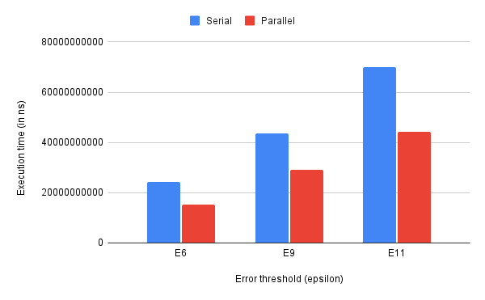
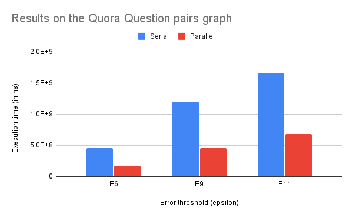
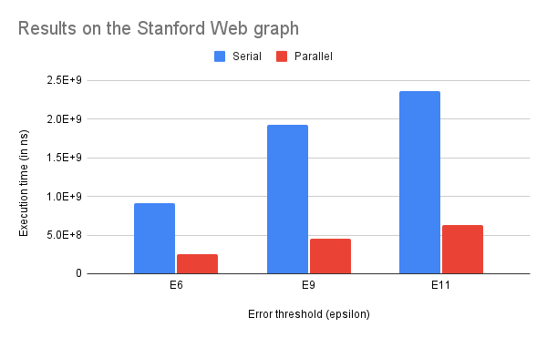
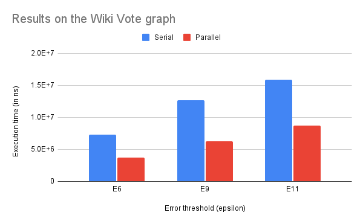
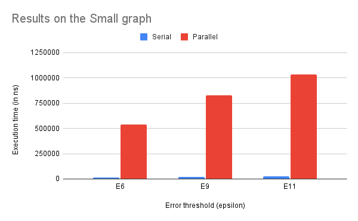

# Parallel Pagerank using goroutines

## Usage

### Testing

Correctness tests compare the outputs from [Daniel Cadenas' implementation in Go](https://github.com/dcadenas/pagerank), serial Pagerank and parallel Pagerank.

To run all correctness tests on all datasets:
```
go test
```

To run tests for a specific dataset. For example, the Wiki vote dataset (note the first letter should be in uppercase):
```
go test -run Wiki
```
Refer [Datasets](#datasets) for a list of available datasets.

### Benchmarks

Benchmarks compare the execution time of Serial vs Parallel on three different values of `eps` (error threshold): `10e-6`, `10e-9` and `10e-11`.

To run all benchmarks on all datasets:
```
go test -run None -bench .
```

To run benchmarks for a specific dataset. For example, the Stanford web graph (note: the first letter is in uppercase):
```
go test -run None -bench Stanford
```
Refer [Datasets](#datasets) for a list of available datasets.

## Code Structure

### Implementation

Serial: [`topoPageRank.go`](./topoPageRank.go#L10)

Parallel: [`topoPageRank.go`](./topoPageRank.go#L89)

### Utilities

 - [`main.go`](./main.go):
    - utilities for reading datasets
    - utilities for converting graphs to adjacency array and CSR format
    - main function to be used for `go tool pprof` profiling`
       - Note: binaries built from this will not include any tests or benchmarks

### Tests and Benchmarks

 - [`topoPageRank_test.go`](./topoPageRank_test.go): Test helpers and tests & benchmarks for small & large graph
 - [`wikiVote_test.go`](./wikiVote_test.go): Tests and benchmarks for Wiki Vote Dataset
 - [`stanford_test.go`](./stanford_test.go): Tests and benchmarks for Stanford Web graph
 - [`quora_test.go`](./quora_test.go): Tests and benchmarks for Quora Question pairs graph

## Datasets

List of datasets which are tested and benchmarked on (these values can be passed to `-run` or `-bench`):
 - `Small`
 - `Wiki`
 - `Quora`
 - `Stanford`
 - `Large`

Refer [Datasets](../datasets/) for more details.

## Results

Benchmark results as tested on a 4-core, 8-threads system. Refer the slides for information on cache characteristics of different graphs which explains the results we observed.

### Large Graph - 1.58x speedup



### Quora Question pairs Graph - 2.64x speedup



### Stanford Web Graph - 4.23x speedup



### Wiki Vote Graph - 2.02x speedup



### Small Graph - 42x _slowdown_


